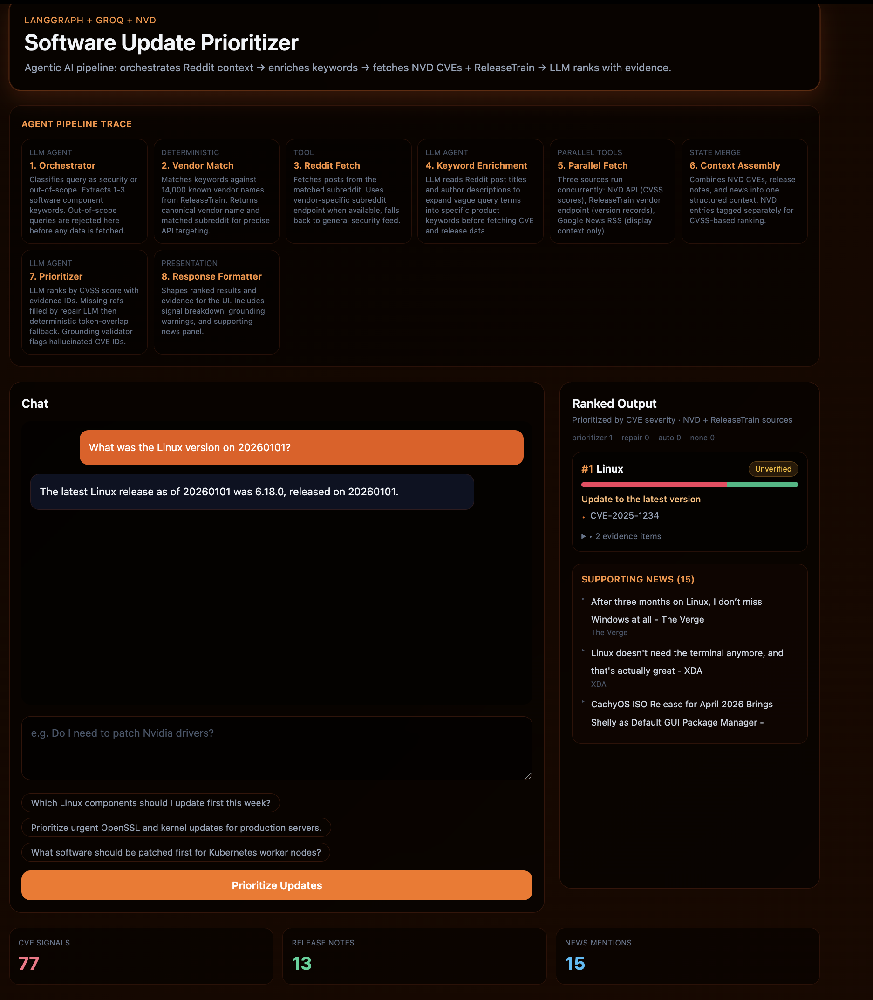
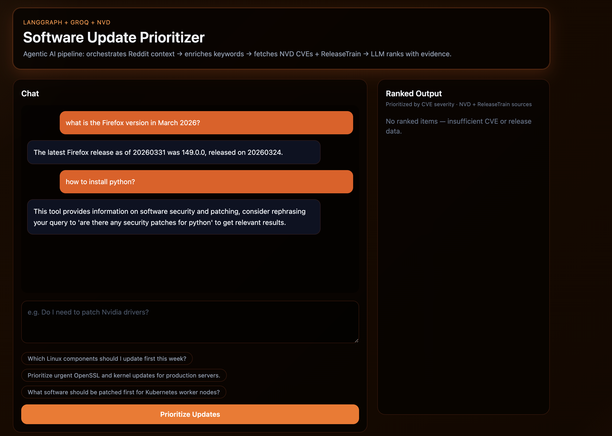

# Software-Update-Prioritizer

A LangGraph based multi-agent system that answers natural language software security queries using real time data from NVD (NIST), ReleaseTrain, Reddit, and Google News. The system is designed to prevent hallucination through three layer evidence grounding and explicit abstention when data is insufficient.

## How It Works

User query flows through a directed acyclic graph of specialized nodes:

```
User Query
    ↓
Orchestrator         classify intent, extract component keywords
    ↓
Vendor Match         match against 14,000 known vendors, find subreddit
    ↓
Reddit Fetch         fetch posts from matched subreddit
    ↓
Reddit Enrich        LLM expands vague keywords using Reddit context
    ↓
NVD + ReleaseTrain + Google News    parallel fetch
    ↓
Merge                combine all sources into one context
    ↓
Prioritize           LLM ranks by CVSS score with evidence grounding
    ↓
Format               structured response for UI
```

## Agent Nodes

| Node | Type | Role |
|---|---|---|
| orchestrator | LLM | Classify intent, extract software keywords |
| vendor_match | Deterministic | Match against 14K vendor list, find subreddit |
| reddit_questions_fetch | Tool | Fetch subreddit posts |
| reddit_enrich | LLM | Expand keywords from Reddit context |
| release_train_fetch | Tool | Fetch version records from vendor endpoint |
| nvd_fetch | Tool | Fetch CVEs from NIST API with CVSS scores |
| google_news_fetch | Tool | Fetch news headlines (display only, not sent to LLM) |
| merge | Deterministic | Combine all sources, tag NVD entries |
| prioritize | LLM + repair + fallback | Rank with evidence refs, 3-layer grounding |
| format | Deterministic | Shape output for UI |

If both CVE and release note arrays are empty the system returns "I don't know" rather than generating an unsupported answer.
I used GROQ_MODEL=llama-3.3-70b-versatile as LLM.

## Run Backend

```
uvicorn backend.api:api --reload
```

API available at `http://127.0.0.1:8000`

## Run Frontend

```
cd frontend
npm install
npm run dev
```

UI available at `http://localhost:5173`

Optional frontend env:

```
echo "VITE_API_BASE=http://127.0.0.1:8000" > frontend/.env
```

## Evaluation

Run the pilot evaluation script against live APIs:

```
python evaluate.py
```
Tests 5 query categories: version lookup, CVE lookup, date specific query, out of scope detection, multi source CVE lookup.




### Poster

